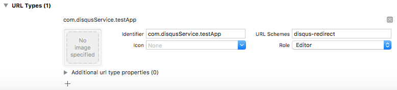

# DisqusService

Wrapper for Disqus APIs written in Swift.
This open-source library allows you to integrate it into your iOS apps.
Learn more about [Disqus APIs](https://disqus.com/api/docs/).

[](http://cocoapods.org/pods/DisqusService)
[](https://swift.org)
[](http://www.apple.com/ios)
[](https://github.com/ascarrambad/DisqusService/master/LICENSE)

## Installation

DisqusService is available through [CocoaPods](http://cocoapods.org). To install
it, simply add the following line to your Podfile:

```ruby
pod 'DisqusService'
```
## Usage

Add the following code in your `AppDelegate` class

```swift
func application(_ application: UIApplication, didFinishLaunchingWithOptions launchOptions: [UIApplicationLaunchOptionsKey : Any]? = nil) -> Bool {
    DisqusService.shared.set(publicKey: "<your-public-key>",
                             secretKey: "<your-secret-key>",
                             redirectURI: "<your-redirect-uri>")
}

@available(iOS 9.0, *)
func application(_ app: UIApplication, open url: URL, options: [UIApplicationOpenURLOptionsKey : Any] = [:]) -> Bool {
    if let sourceApplication = options[.sourceApplication] as? String {
        if sourceApplication == "com.apple.SafariViewService" {
            NotificationCenter.default.post(name: .DisqusServiceSafariAuthDidClose, object: url)
        }
    }
    return true
}
```

Because Disqus APIs don't support schemes to redirect your app after OAuth authentication, you MUST provide an URL which then redirects to the following scheme: `disqus-redirect://`.
To do so in Project Settings → Info: scroll down to **URL Types** and add an entry with `+`

- **Identifier**: your-app-bundle-id, i.e. `com.disqusService.testApp`
- **URL Schemes**: `disqus-redirect`



Authenticating/Deauthenticating a user is very simple:
```swift
DisqusService.shared.authenticate(viewController: yourVC) { (success) in
    if success {
        
    } else {
        
    }
}

////////////////

DisqusService.shared.logout()
```

This library also includes a convenient class called DisqusComment to better handle received comments from a thread.
Here's an example:

```swift

let params = ["thread" : "<your-thread-id>", "order" : "asc"]
let posts: [DisqusComment] = []

DisqusService.shared.performGETRequest(api: "posts/list", authRequired: false, params: params) { (data, success) -> Void in
    if success {
        let posts = data?["response"] as! [[AnyHashable : Any]]

        for postJSON in posts {
            if let post = DisqusComment(disqusData: postJSON) {
                posts.append(post)
            }
        }
    }
}
```

Please note that certain APIs require authentication and MUST be specified.
API usage example:

```swift

let paramsDetails = ["forum" : "<your-forum>", "thread" : "<your-thread-id>"]
DisqusService.shared.performGETRequest(api: "threads/details", authRequired: false, params: paramsDetails) { (data, success) in

}

let paramsVote = ["post" : "<your-post-id>", "vote" : "1"]
DisqusService.shared.performPOSTRequest(api: "posts/vote", authRequired: true, params: paramsVote) { (data, success) in

}
```

## Author

Matteo Riva, matteo.riva@outlook.com

## License

DisqusService is available under the MIT license. See the LICENSE file for more info.
